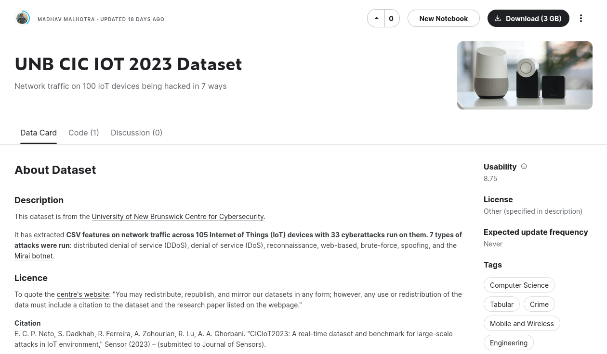

# Exploring the CIC-IoT-2023 Dataset

The Canadian Insitute of Cybersecurity at the University of New Brunswick published the open source [CIC-IoT-2023 dataset](https://www.kaggle.com/datasets/madhavmalhotra/unb-cic-iot-dataset). This dataset promotes **research on how to detect 7 kinds of cyberattacks across 100 IoT devices**.

Leading a [team of 15 at the University of Waterloo](https://wataicyber.substack.com/), this repository contains useful notebooks for sampling, preprocessing, visualising, and training models on the CIC-IoT-2023 dataset.

### Notebook descriptions
1. `downsampling.ipynb` - This notebook samples 0.1, 0.5, 1, 5, and 10% of the rows from each cyberattack class from the dataset. This reduces the dataset size from 14GB to 12-600 MB, making it easier to perform feature visualisation and feature selection. [Kaggle](https://www.kaggle.com/code/madhavmalhotra/creating-a-smaller-dataset-for-ciciot2023). [Blog](https://wataicyber.substack.com/p/sparse-data-and-spurious-correlations).
2. `heatmaps.ipynb` - This notebook tries to understand which of the around 50 features are most important for training ML models. It notes some of the problems with simple correlational analysis and heatmaps. [Kaggle](https://www.kaggle.com/code/madhavmalhotra/feature-exploration-on-ciciot2023). [Blog](https://wataicyber.substack.com/p/sparse-data-and-spurious-correlations).
3. `greyWolf.ipynb` - This notebook finds useful features from the 46 total features in the dataset. It uses the Grey Wolf Optimiser to do this. [Kaggle](https://www.kaggle.com/code/madhavmalhotra/feature-selection-with-a-grey-wolf-optimiser). [Blog](https://wataicyber.substack.com/p/the-grey-wolf-optimiser).
4. `geneticAlgorithm.ipynb` - This notebook reduces the 46 features in the dataset to 20 uesful features. It also visualises how the genetic algorithm works while doing this. [Kaggle](https://www.kaggle.com/code/madhavmalhotra/genetic-algorithm-feature-selection/). [Blog](https://wataicyber.substack.com/p/fun-graphs-with-genetic-algorithms).
5. `unsupervisedClustering.ipynb` - This notebook compares the negative selection algorithm, k-means clustering, and DBSCAN to generate signatures of benign network requests. [Kaggle](https://www.kaggle.com/code/madhavmalhotra/unsupervised-clustering-and-negative-selection). [Blog](https://wataicyber.substack.com/p/density-based-clustering-for-the).

### Useful Links
1. [CIC-IoT-2023 Dataset on Kaggle](https://www.kaggle.com/datasets/madhavmalhotra/unb-cic-iot-dataset)
2. [Our team blog has more details about the notebooks](https://wataicyber.substack.com/)
3. [The original paper describing the dataset](https://www.mdpi.com/1424-8220/23/13/5941)